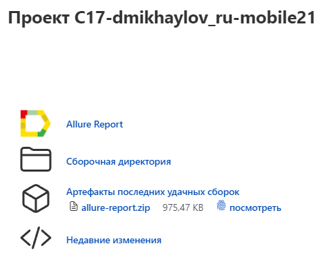
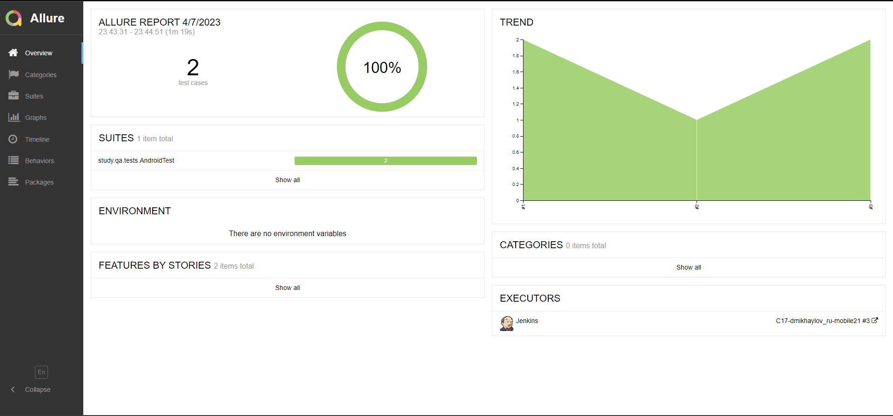
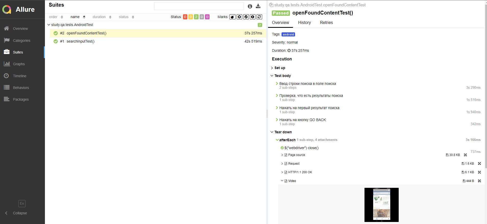
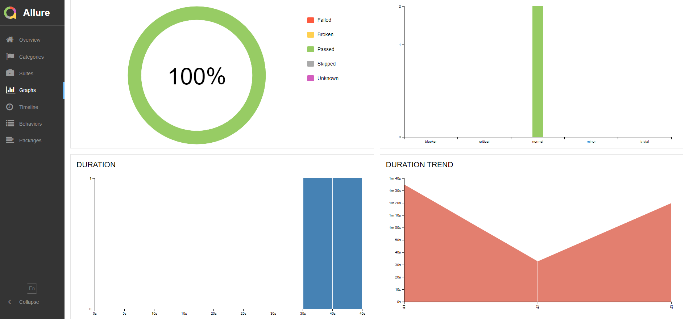
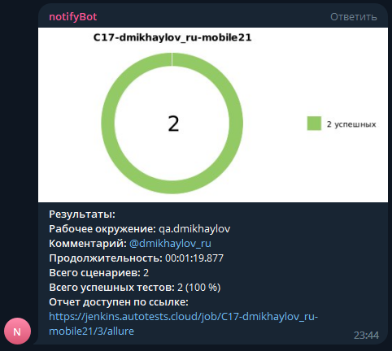

# Автоматизация тестирования <a href="https://www.browserstack.com/" target="_blank">Browserstack</a>

## :scroll: Содержание
- [Технологии и инструменты](#pushpin-технологии-и-инструменты)
- [Запуск тестов](#pushpin-запуск-тестов)
- [Конфигурация тестов](#pushpin-конфигурация-тестов)
- [Описание параметров для сборки](#pushpin-описание-параметров-для-сборки)
- [Задача в Jenkins](#pushpin-задача-в-jenkins)
- [Отчёт Allure](#pushpin-отчёт-allure)
- [Отчёт Telegram](#pushpin-отчёт-telegram)

## :pushpin: Технологии и инструменты

## :pushpin: Запуск тестов
### Локально
для android-тестов: <code>gradle clean android -Denv=android</code>
для ios-тестов: <code>gradle clean ios -Denv=ios</code>

### Удалённо
для android-тестов: <code>clean android -Denv=android</code>
для ios-тестов: <code>clean ios -Denv=ios</code>

## :pushpin: Конфигурация тестов
### android.properties
### ios.properties
- **user** - имя пользователя
- **key** - пароль
- **app_url** - идентификатор приложения
- **device** - мобильное устройство
- **os_version** - версия операционной системы
- **project** - название проекта в BS
- **build** - название билда в BS
- **name** - название теста в BS
- **remote_url** - hub URI

## :pushpin: Описание параметров для сборки
- <code>device</code> устройство, для которого запускаются тесты (android или ios)

## :pushpin: Задача в Jenkins

## :pushpin: Отчёт Allure

## :pushpin: Отчёт Telegram

[Вернуться к содержанию](#scroll-содержание)